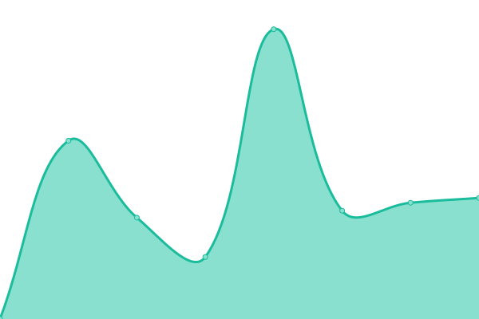

# [📈 Live Status](https://RishCoder-Tech.github.io/CoguideUptime): <!--live status--> **🟧 Partial outage**

With [Upptime](https://upptime.js.org), you can get your own unlimited and free uptime monitor and status page, powered entirely by a GitHub repository. We use [Issues](https://github.com/RishCoder-Tech/CoguideUptime/issues) as incident reports, [Actions](https://github.com/RishCoder-Tech/CoguideUptime/actions) as uptime monitors, and [Pages](https://RishCoder-Tech.github.io/CoguideUptime) for the status page.

<!--start: status pages-->
<!-- This summary is generated by Upptime (https://github.com/upptime/upptime) -->
<!-- Do not edit this manually, your changes will be overwritten -->
<!-- prettier-ignore -->
| URL | Status | History | Response Time | Uptime |
| --- | ------ | ------- | ------------- | ------ |
|  [Coguide](https://coguide.ai) | 🟩 Up | [coguide.yml](https://github.com/RishCoder-Tech/CoguideUptime/commits/HEAD/history/coguide.yml) | 

 506ms
     
 | 

<a href="https://RishCoder-Tech.github.io/CoguideUptime/history/coguide">99.82%</a>
    

|  [Coguide Backend](https://login.coguide.ai) | 🟥 Down | [coguide-backend.yml](https://github.com/RishCoder-Tech/CoguideUptime/commits/HEAD/history/coguide-backend.yml) | 

 264ms
     
 | 

<a href="https://RishCoder-Tech.github.io/CoguideUptime/history/coguide-backend">99.80%</a>
    

<!--end: status pages-->
